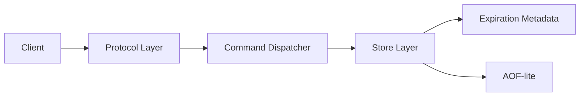

# 02. Architecture

## 아키텍처 목표
- 구조를 단순하게 유지한다.
- 명령 의미론을 중앙에서 통제한다.
- 테스트 가능한 경계로 계층을 나눈다.
- 동시성 안전성을 구현 난이도보다 우선한다.

## 권장 계층



### 1) Protocol Layer
역할:
- 외부 요청을 읽는다.
- 명령 이름과 인자를 파싱한다.
- 응답을 프로토콜 형식으로 직렬화한다.

고정 결정:
- HTTP + JSON

### 2) Command Dispatcher
역할:
- 명령 이름 검증
- 인자 개수 검증
- 에러 응답 통일
- store 메서드 호출

### 3) Store Layer
역할:
- 실제 key/value 저장
- overwrite, delete, get 처리
- expiration check
- atomic한 store-level 동작 보장

구조:
- `data_map`: key -> value
- `expire_map`: key -> expires_at(unix time)

### 4) Expiration Metadata
역할:
- lazy expiration: 조회/접근 시 만료 검사
- periodic sweep: 주기적 만료 정리

### 5) AOF-lite
역할:
- write 명령 append
- 서버 시작 시 replay

## 권장 동시성 모델

### 옵션 A. coarse lock
- store 전체에 락 1개
- 장점: 구현 단순, semantics 안정적
- 단점: 병렬 처리량 낮음

### 옵션 B. single event loop
- 한 번에 한 요청씩 처리
- 장점: race condition 관리 쉬움
- 단점: 느린 작업 하나가 전체를 막을 수 있음

**권장 결정**: coarse lock 또는 single-thread loop 둘 중 하나만 선택한다.

## 명령 처리 흐름
1. client 요청 도착
2. parser가 command와 args 추출
3. dispatcher가 command semantics 검증
4. store가 실제 로직 수행
5. 필요하면 AOF-lite append
6. serializer가 응답 작성
7. client에 반환

## expiration 흐름

### lazy expiration
- `GET key`
- `expire_map[key] <= now` 이면
  - `data_map`과 `expire_map`에서 제거
  - missing으로 처리

### periodic sweep
- 1초마다 또는 일정 간격으로 일부 key 검사
- 이미 만료된 key 정리
- 전체 key full scan은 피하고, 구현 난이도에 따라 간단 버전 허용

## persistence 흐름 (선택)

### append
- `SET a 1`
- `DEL a`
- `EXPIRE a 10`
- `PERSIST a`

write 계열 명령만 로그에 append

### replay
- 서버 시작 시 파일을 순서대로 읽음
- dispatcher 또는 replay executor로 재적용
- replay 중에는 다시 append 하지 않도록 보호

## 추천 디렉토리
```text
app/
  protocol/
    http_parser.py
    serializer.py
    http_handlers.py
  commands/
    dispatcher.py
    registry.py
    errors.py
  core/
    hash_table.py
    store.py
    expiration.py
    lock.py
  persistence/
    aof.py
    replay.py
  main.py

tests/
  unit/
  integration/
  smoke/
  benchmark/
```

## 설계 원칙
- protocol은 storage 세부 구현을 몰라야 한다.
- store는 HTTP 요청/응답 형식을 몰라야 한다.
- 테스트는 계층마다 분리한다.
- stretch 기능은 core semantics를 흔들지 않는 범위에서만 추가한다.
