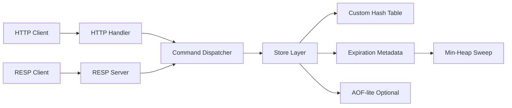

# 02. Architecture

## 아키텍처 목표
- 구조를 단순하게 유지한다.
- 명령 의미론을 중앙에서 통제한다.
- HTTP와 RESP가 같은 dispatcher 결과를 공유하게 한다.
- 테스트 가능한 경계로 계층을 나눈다.
- 동시성 안전성을 구현 난이도보다 우선한다.

## 권장 계층



### 1) Protocol Layer
역할:
- 외부 요청을 읽는다.
- 명령 이름과 인자를 파싱한다.
- 같은 semantic result를 HTTP 또는 RESP 형식으로 직렬화한다.

고정 결정:
- HTTP entrypoint는 `FastAPI`를 사용한다.
- RESP entrypoint는 subset TCP server로 구현한다.
- 외부 인터페이스는 `HTTP + JSON`과 `RESP subset TCP`를 함께 유지한다.
- HTTP를 제거하지 않고, RESP는 추가 접근 경로로 붙인다.
- 두 entrypoint 모두 같은 dispatcher를 호출한다.

#### HTTP handler
역할:
- endpoint / JSON body 파싱
- HTTP status 및 JSON 응답 직렬화

#### RESP server
역할:
- RESP frame 읽기
- `array of bulk strings` 요청만 허용
- RESP simple string / bulk string / integer / error 응답 직렬화

### 2) Command Dispatcher
역할:
- 명령 이름 검증
- 인자 개수 검증
- 에러 응답 통일
- store 메서드 호출
- protocol layer와 store layer 사이의 얇은 중간 계층 유지

고정 결정:
- dispatcher는 가벼운 command registry를 사용한다.
- command handler는 class 기반 command object가 아니라 plain function으로 구현한다.
- dispatcher의 semantic result는 protocol-neutral이어야 한다.

### 3) Store Layer
역할:
- 실제 key/value 저장
- overwrite, delete, get 처리
- expiration check
- atomic한 store-level 동작 보장

구조:
- `data_table`: key -> value
- `expire_map`: key -> expires_at(unix time)
- `expiration_heap`: `(expires_at, key)` min-heap

고정 결정:
- 기본 저장 구조는 custom hash table이다.
- public `Store` API는 유지하고, 내부 자료구조만 교체한다.
- custom hash table 구현 전략은 아래처럼 고정한다.
  - open addressing
  - linear probing
  - hash function: `FNV-1a 64-bit`
  - delete는 tombstone 사용
  - load factor가 `0.7`을 초과하면 capacity를 2배로 늘린다.
  - v1에서는 shrink를 구현하지 않는다.
- 만료 시각은 상대 시간이 아니라 절대 만료 시각(unix timestamp)으로 저장한다.

### 4) Expiration Metadata
역할:
- lazy expiration: 조회/접근 시 만료 검사
- periodic sweep: 주기적 만료 정리

고정 결정:
- lazy expiration은 유지한다.
- periodic sweep는 min-heap 기반으로 실행한다.
- sweeper는 heap head를 확인하고, 현재 시각 이하인 항목만 pop하며 정리한다.
- stale heap entry는 `expire_map` 대조 후 건너뛴다.
- periodic sweep는 1초 주기 tick으로 시작한다.
- sweep도 일반 명령과 동일한 `threading.Lock`을 잡고 동작한다.

### 5) AOF-lite
역할:
- write 명령 append
- 서버 시작 시 replay

고정 결정:
- AOF-lite는 현재 활성 병렬 트랙의 구현 대상이 아니다.
- 다만 추후 추가를 쉽게 하기 위해 `app/persistence/` 구조와 조립 지점은 열어둔다.

## HTTP API Contract

이 문서는 HTTP 엔드포인트와 요청/응답 모양을 고정한다.
명령의 의미론은 `docs/03-command-semantics.md`를 따른다.

### 공통 규칙
- 모든 HTTP 응답은 JSON이다.
- 성공 응답 구조와 에러 응답 구조는 `docs/03-command-semantics.md`를 따른다.
- 없는 key 조회는 `404`가 아니라 `200 OK`다.
- 문자열 key와 문자열 value만 지원한다.
- RESP가 추가되어도 아래 HTTP 엔드포인트는 그대로 유지한다.

### 엔드포인트

#### `GET /v1/ping`
용도:
- 서버 생존 확인

성공 응답:
```json
{ "result": "PONG" }
```

#### `GET /v1/keys/{key}`
용도:
- key 조회

성공 응답:
```json
{ "found": true, "value": "hello" }
```

또는
```json
{ "found": false, "value": null }
```

#### `PUT /v1/keys/{key}`
용도:
- key 저장 또는 덮어쓰기

요청 바디:
```json
{ "value": "hello" }
```

성공 응답:
```json
{ "result": "OK" }
```

#### `DELETE /v1/keys/{key}`
용도:
- key 삭제

성공 응답:
```json
{ "result": 1 }
```

#### `POST /v1/keys/{key}/expire`
용도:
- key 만료 시간 설정

요청 바디:
```json
{ "seconds": 10 }
```

성공 응답:
```json
{ "result": 1 }
```

#### `GET /v1/keys/{key}/ttl`
용도:
- 남은 TTL 조회

성공 응답:
```json
{ "result": 9 }
```

#### `DELETE /v1/keys/{key}/expiration`
용도:
- 설정된 expiration 제거

성공 응답:
```json
{ "result": 1 }
```

## RESP Entry Contract

이 문서는 RESP의 transport shape만 고정한다.
명령 의미론은 HTTP와 동일하게 `docs/03-command-semantics.md`를 따른다.

### 공통 규칙
- 요청은 `array of bulk strings`만 지원한다.
- command 이름과 인자는 RESP bulk string으로 전달한다.
- inline command, nested array, non-bulk element는 protocol error다.
- semantic result는 dispatcher가 만들고, RESP server는 해당 결과를 wire format으로 직렬화한다.

요청 예:
```text
*2\r\n$3\r\nGET\r\n$3\r\nfoo\r\n
```

## HTTP Error Message Convention

HTTP 에러 응답 형식은 아래처럼 고정한다.

```json
{ "error": "..." }
```

메시지 규칙:
- unknown or unsupported command -> `"unknown command: <COMMAND>"`
- wrong number of arguments -> `"wrong number of arguments for <COMMAND>"`
- invalid integer parse -> `"invalid integer for <COMMAND>: <VALUE>"`
- wrong type -> `"wrong type for <COMMAND>"`
- internal error -> `"internal error"`
- protocol-level request validation도 같은 `{ "error": "..." }` 형식으로 정규화한다.
- endpoint로 command를 알 수 있으면 누락된 필수 JSON 필드는 `"wrong number of arguments for <COMMAND>"`로 매핑한다.
- endpoint로 command를 알 수 있으면 잘못된 JSON 타입은 `"wrong type for <COMMAND>"`로 매핑하고, raw malformed JSON은 `400` + `"invalid request"`를 사용한다.

표기 규칙:
- `<COMMAND>`는 대문자 명령 이름을 사용한다.
- 가능한 한 짧고 일정한 영어 문구를 유지한다.
- HTTP status mapping은 `docs/03-command-semantics.md`를 따른다.

## Store API Contract

store는 protocol을 몰라야 하므로, 내부 API는 직렬화 형식과 분리한다.

권장 public API:

```python
class Store:
    def get(self, key: str) -> tuple[bool, str | None]:
        ...

    def set(self, key: str, value: str) -> str:
        ...

    def delete(self, key: str) -> int:
        ...

    def expire(self, key: str, seconds: int) -> int:
        ...

    def ttl(self, key: str) -> int:
        ...

    def persist(self, key: str) -> int:
        ...

    def sweep_expired(self) -> int:
        ...
```

의미:
- `get(key)` -> `(found, value)` 반환
- `set(key, value)` -> 성공 시 `"OK"`
- `delete(key)` -> 실제 삭제 개수 반환
- `expire(key, seconds)` -> 성공/실패를 `1` 또는 `0`으로 반환
- `ttl(key)` -> `-2`, `-1`, 또는 0 이상의 남은 초 반환
- `persist(key)` -> 성공/실패를 `1` 또는 `0`으로 반환
- `sweep_expired()` -> 이번 sweep에서 정리한 key 개수 반환

구현 규칙:
- 모든 public 메서드는 동일한 store-level lock 규칙을 따른다.
- 메서드 내부에서 expired key를 만나면 lazy expiration 규칙에 따라 정리할 수 있다.
- dispatcher는 store의 반환값을 HTTP 또는 RESP 응답 구조로 변환할 수 있어야 한다.
- store 메서드는 `HTTPException`, FastAPI response object, raw socket object를 직접 다루지 않는다.

## 동시성 모델

### 결정: store-level coarse lock
- store 전체에 `threading.Lock` 1개를 둔다.
- HTTP와 RESP는 동시 요청을 받을 수 있지만, store 진입은 lock으로 직렬화한다.
- `GET`, `SET`, `DEL`, `EXPIRE`, `TTL`, `PERSIST`는 모두 같은 lock 규칙을 따른다.
- lazy expiration, periodic sweep, 추후 replay apply도 같은 lock 규칙을 따른다.
- lock을 요청 처리용, sweep용, replay용으로 분리하지 않는다.
- 각 store 메서드는 atomic한 store-level 동작으로 완료되어야 한다.

선택 이유:
- MVP 목표가 처리량보다 semantics 안정성과 데모 안정성에 더 가깝다.
- protocol 구현과 store 구현을 강하게 결합하지 않아 branch-scoped 작업에 유리하다.
- dual-entry 구조에서도 concurrency model을 단순하게 유지할 수 있다.

이번 MVP에서 하지 않는 것:
- single event loop 기반 직렬 처리
- per-key lock
- read/write lock
- lock-free 구조

## 명령 처리 흐름
1. HTTP 요청 또는 RESP frame이 도착한다.
2. HTTP handler 또는 RESP server가 transport 형식을 파싱한다.
3. protocol layer가 dispatcher를 호출한다.
4. dispatcher가 command semantics와 arity를 검증한다.
5. store가 실제 로직을 수행한다.
6. 필요하면 향후 AOF append 지점으로 전달한다.
7. HTTP serializer 또는 RESP serializer가 응답을 작성한다.
8. client에 반환한다.

## Expiration 흐름

### lazy expiration
- key 접근 시마다 만료 여부를 확인한다.
- `expire_map[key] <= now` 이면
  - `data_table`, `expire_map`에서 제거한다.
  - missing으로 처리한다.

### periodic sweep
- 1초마다 sweep tick을 실행한다.
- 시작 버전은 heap head를 보고 현재 시각 이하인 항목만 정리한다.
- stale heap entry는 `expire_map`에 저장된 현재 값과 비교해 무시한다.
- sweep도 일반 명령과 동일한 `threading.Lock`을 잡고 동작한다.

## Persistence 흐름 (미래 확장용)

### append
- `SET a 1`
- `DEL a`
- `EXPIRE a 10`
- `PERSIST a`

write 계열 명령만 로그에 append한다.

### replay
- 서버 시작 시 파일을 순서대로 읽는다.
- dispatcher 또는 replay executor로 재적용한다.
- replay 중에는 다시 append 하지 않도록 보호한다.

현재 상태:
- persistence는 구조만 열어두고 이번 활성 병렬 트랙에서는 구현하지 않는다.

## main.py 조립 원칙

`app/main.py`는 서버의 시작점이며, 이 파일의 역할은 비즈니스 로직 구현이 아니라 **모듈 조립(composition root)** 과 **lifecycle 관리**다.
즉 `main.py`는 객체를 생성하고 연결하며, 서버 시작 순서와 종료 순서를 통제한다.
`GET`, `SET`, `DEL`, `EXPIRE`, `TTL`, `PERSIST`의 의미론이나 HTTP / RESP 직렬화 규칙은 `main.py`에서 구현하지 않는다.

병렬 작업 소유:
- `app/main.py`는 `feature/protocol-resp` 트랙의 hotspot 파일이다.
- 다른 트랙은 이 파일을 직접 수정하지 않는 것을 원칙으로 한다.

### 의존 방향
- `HTTP handler -> Command Dispatcher -> Store`
- `RESP server -> Command Dispatcher -> Store`
- protocol layer는 dispatcher를 호출한다.
- dispatcher는 command 이름/arity 검증, 에러 통일, store 호출을 담당한다.
- store는 실제 key/value 저장, expiration 검사, atomic한 store-level 동작을 담당한다.
- store는 HTTP / RESP 요청과 응답 형식을 알지 못해야 한다.
- protocol layer는 store 내부 자료구조를 직접 알지 못해야 한다.

### main.py의 조립 원칙
`main.py`는 아래 순서로 모듈을 조립한다.

1. `Store`를 생성한다.
2. 필요하면 `AOF writer` 또는 persistence 관련 객체를 생성한다.
3. `Dispatcher(store, optional_aof_writer)`를 생성한다.
4. `HttpHandler(dispatcher)`를 생성한다.
5. `RespServer(dispatcher)`를 생성한다.
6. expiration sweeper를 시작한다.
7. HTTP server와 RESP server를 listen 상태로 전환한다.

### startup sequence
권장 시작 순서는 아래와 같다.

1. store 생성
2. persistence 객체 생성(선택)
3. dispatcher 생성
4. AOF replay 수행(선택)
5. HTTP handler / server 생성
6. RESP server 생성
7. expiration sweeper 시작
8. 각 서버 listen 시작

### replay 정책
AOF replay는 반드시 **server listen 이전**에 수행한다.
이유는 복구가 끝나지 않은 중간 상태를 외부 요청이 관찰하면 안 되기 때문이다.
replay 중에는 append가 다시 발생하지 않도록 보호해야 한다.

### expiration sweep 정책
periodic sweep는 store와 동일한 동시성 규칙을 따라야 한다.
즉 sweep가 store를 접근할 때도 일반 명령과 동일한 **store-level coarse lock**을 사용한다.
현재 활성 설계는 min-heap 기반 sweep다.

### shutdown sequence
권장 종료 순서는 아래와 같다.

1. 새 요청 수신 중단
2. sweeper 중단
3. 필요하면 AOF flush / close
4. 서버 종료

### 비목표
`main.py`는 아래 책임을 가져서는 안 된다.

- command semantics 구현
- HTTP 또는 RESP 응답 포맷 결정
- store 내부 자료구조 직접 조작
- protocol layer와 store layer의 강한 결합

## 추천 디렉토리
```text
app/
  protocol/
    http_handlers.py
    schemas.py
    resp_server.py
    resp_parser.py
    resp_codec.py
  commands/
    dispatcher.py
    registry.py
    errors.py
  core/
    store.py
    hash_table.py
    expiration.py
    expiration_heap.py
    lock.py
  persistence/
    aof.py
    replay.py
  main.py

tests/
  unit/
  integration/
  smoke/
  benchmark/
```

## 설계 원칙
- protocol은 storage 세부 구현을 몰라야 한다.
- store는 HTTP / RESP 요청과 응답 형식을 몰라야 한다.
- HTTP와 RESP는 같은 command semantics를 재사용해야 한다.
- 테스트는 계층마다 분리한다.
- stretch 기능은 core semantics를 흔들지 않는 범위에서만 추가한다.
